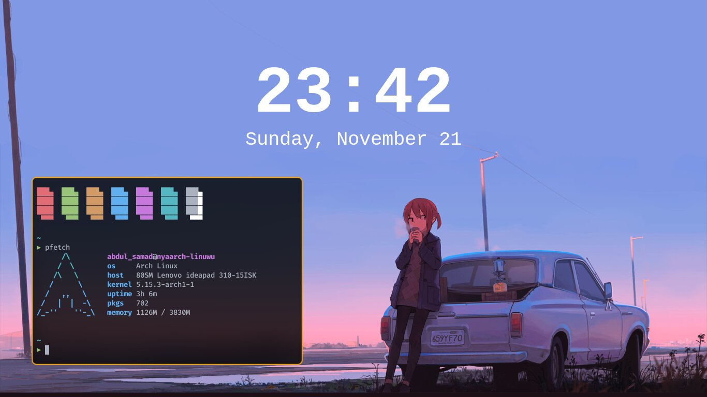

# My Own Personal Dotfiles

Software that I use:
* [alacritty](https://github.com/alacritty/alacritty) -> Terminal
* [bspwm](https://github.com/baskerville/bspwm) -> Window Manager
* [conky widget](https://github.com/brndnmtthws/conky) -> System Monitor
+ [neovim](https://neovim.io) -> IDE/Text Editor
* [picom](https://github.com/ibhagwan/picom) -> Compositor (iBhagwan fork)
* [rofi](https://github.com/davatorium/rofi) -> Application Launcher
* [sxhkd](https://github.com/baskerville/sxhkd) -> Hotkey Daemon
* [starship](https://starship.rs) -> Shell Prompt
