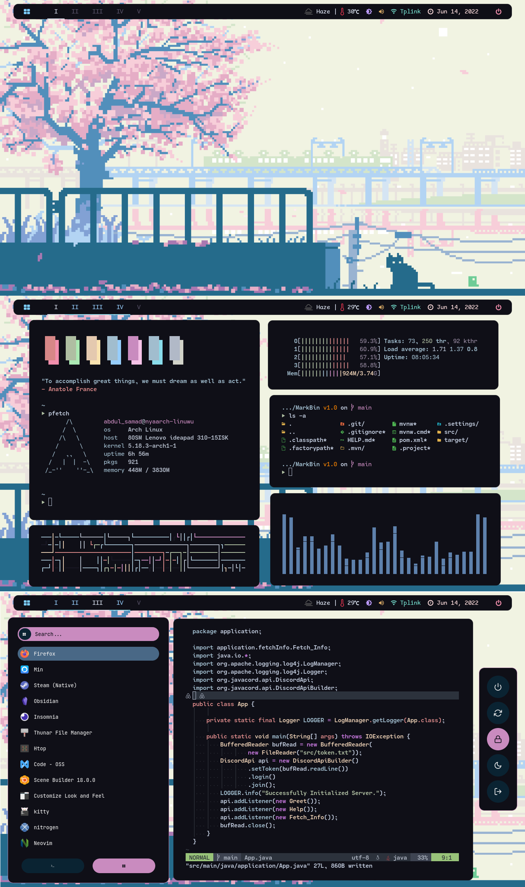
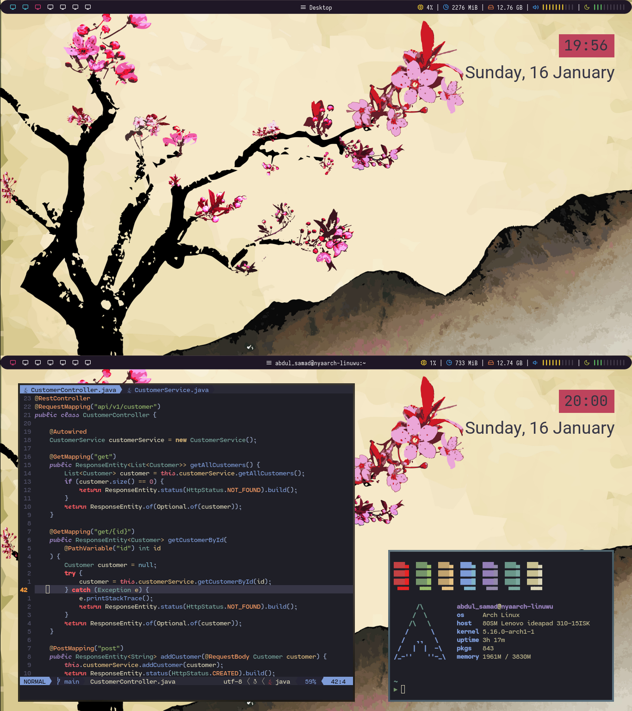
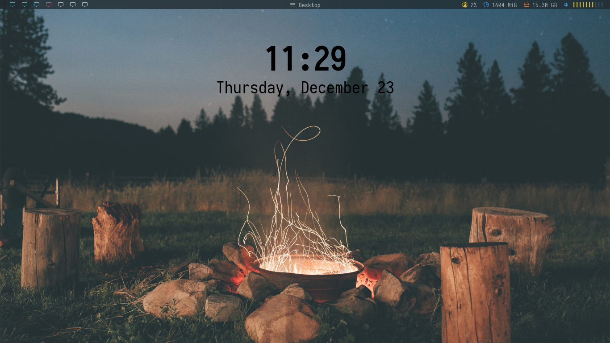
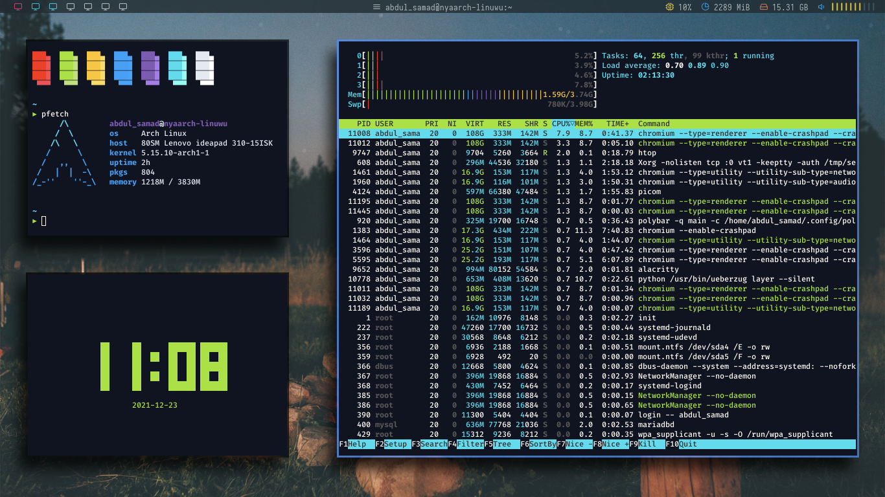
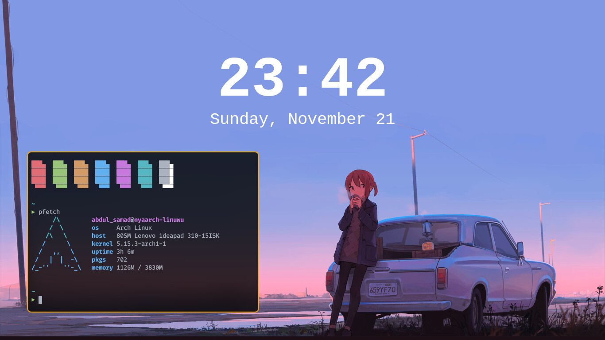

# My Own Personal Dotfiles

### Software that I use:
* [alacritty](https://github.com/alacritty/alacritty) -> Terminal
* [bspwm](https://github.com/baskerville/bspwm) -> Window Manager
* [conky widget](https://github.com/brndnmtthws/conky) -> System Monitor
* [neovim](https://neovim.io) -> IDE/Text Editor
* [picom](https://github.com/ibhagwan/picom) -> Compositor (iBhagwan fork)
* [rofi](https://github.com/davatorium/rofi) -> Application Launcher
* [sxhkd](https://github.com/baskerville/sxhkd) -> Hotkey Daemon
* [starship](https://starship.rs) -> Shell Prompt
* [polybar](https://github.com/polybar/polybar) -> Status Bar

### Gallery

#### SAGA

#### Kanagawa

#### Old

#### Very Old

### Credits and Resources:
* [adi1090x](https://github.com/adi1090x/polybar-themes) -> Polybar Themes
* [adi1090x](https://github.com/archcraft-os/archcraft-berry) -> Rofi and Powermenu script
* [rebelot](https://github.com/rebelot/kanagawa.nvim) -> Kanagawa Color Scheme
* [Miusaky](https://github.com/Miusaky) -> SAGA Color Scheme
* [addy-dclxvi](https://github.com/addy-dclxvi/Conky-Theme-Collections) -> Some Conky Themes
* [Deathmonic](https://github.com/Deathemonic/Cat-Dots) -> Stolen and Modified polybar :D
